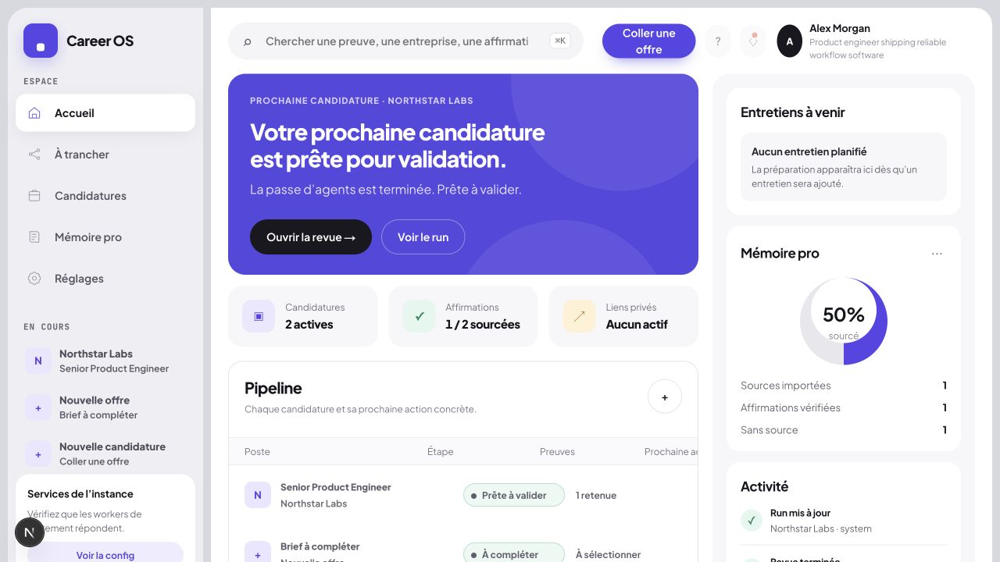
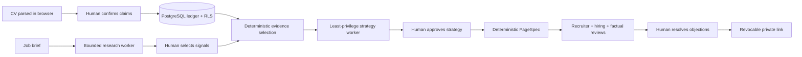

# Career OS

> A resume says you can do the job. Career OS shows its receipts.

[](https://github.com/kevinmarty69/career-os/actions/workflows/ci.yml)
[](LICENSE)

Career OS turns real career evidence into private, role-specific applications. Every published statement stays attached to a source and carries an explicit status: `verified`, `declared`, or `inferred`.

It is deliberately not a generic AI resume generator. Models may research and suggest; typed contracts, PostgreSQL, deterministic checks, and human approval decide what can ship.

## Try the product in two minutes

The built-in demo uses synthetic data and a deterministic in-browser workflow. It needs no account, database, or model:

```bash
pnpm install
pnpm dev
```

Open [localhost:3000](http://localhost:3000), choose **Explorer avec des données fictives**, edit the sample job brief, then generate the application. The demo exercises the evidence, drafting, review, and provenance UI; persistence and private sharing are intentionally disabled until the server is configured.



## The trust boundary is the product



Each durable worker has its own non-owner database login and a narrow function set. Jobs are leased globally without a caller-supplied tenant ID. Model calls happen outside database transactions, under a reserved token budget; an unknown provider outcome fails closed instead of being replayed.

## What is implemented

- local PDF, DOCX, TXT, and pasted-text import in a Web Worker;
- explicit review of provenance, sensitivity, and allowed uses;
- versioned Career Memory and application dossiers;
- SSRF-resistant job URL previews that remain untrusted until confirmed;
- durable, resumable workflow steps with idempotency, leases, and admission limits;
- human gates around research, evidence, strategy, review, and publication;
- tenant isolation with forced RLS and composite tenant foreign keys;
- revocable private capabilities exchanged for secure session cookies;
- export, interruption, worker readiness, and conservative failure settlement.

The repository currently proves the self-hosted implementation. A managed service is a future deployment target; billing, hosted operations, and cloud sandbox infrastructure are not included or claimed as implemented here.

## Proof map

| Claim                                                          | Executable evidence                                                                                                                              |
| -------------------------------------------------------------- | ------------------------------------------------------------------------------------------------------------------------------------------------ |
| Generated statements remain source-bound                       | [`schemas.ts`](lib/schemas.ts), [`reviewer.test.ts`](tests/unit/reviewer.test.ts)                                                                |
| Tenant data cannot cross organization boundaries               | [`tenant_isolation.sql`](supabase/tests/tenant_isolation.sql), [`auth_security.sql`](supabase/tests/auth_security.sql)                           |
| Retries do not duplicate accepted work or spend                | [`durable-step-concurrency.mjs`](supabase/tests/durable-step-concurrency.mjs), [`budget_concurrency.mjs`](supabase/tests/budget_concurrency.mjs) |
| URL import resists SSRF and unsafe redirects                   | [`safe-http.ts`](lib/server/safe-http.ts), [`safe-http.test.ts`](tests/unit/safe-http.test.ts)                                                   |
| CV bytes stay in the browser and hostile documents fail closed | [`profile-import.worker.ts`](lib/profile-import.worker.ts), [`profile-import.test.ts`](tests/unit/profile-import.test.ts)                        |
| Publication requires complete, current reviews                 | [`durable-reviewers.mjs`](supabase/tests/durable-reviewers.mjs), [`publication-security.test.ts`](tests/unit/publication-security.test.ts)       |

CI runs formatting, linting, TypeScript, the unit suite, a production build, and a production-dependency audit. PostgreSQL isolation, concurrency, worker integration, and browser suites remain separate because they require service processes; their commands are documented below and in the self-hosting guide.

## Run the real workflow

The persisted workflow needs PostgreSQL, seven isolated worker credentials, and a loopback OpenAI-compatible model for the four model-backed roles.

See **[Self-hosting Career OS](docs/SELF_HOSTING.md)** for the complete setup, least-privilege role creation, worker supervision, and verification commands.

## Development

```bash
pnpm check
pnpm build
pnpm audit --prod --audit-level high
```

Database and browser verification:

```bash
pnpm db:up
pnpm db:test
pnpm test:integration:worker
pnpm test:e2e
pnpm db:down
```

The PostgreSQL test suite also covers migration compatibility on PostgreSQL 17 without pgvector.

## Decisions worth inspecting

- [Architecture](ARCHITECTURE.md)
- [Security model](SECURITY.md)
- [Why Career OS owns orchestration](docs/ADR-001-agent-runtime.md)
- [Agentic stack benchmark](docs/agentic-stack-benchmark.md)
- [Minimum agentic stack proposal](docs/ADR-002-agentic-stack-selection.md)
- [Authentication and tenancy](docs/ADR-003-authentication.md)

AGPL-3.0-only. See [LICENSE](LICENSE).
