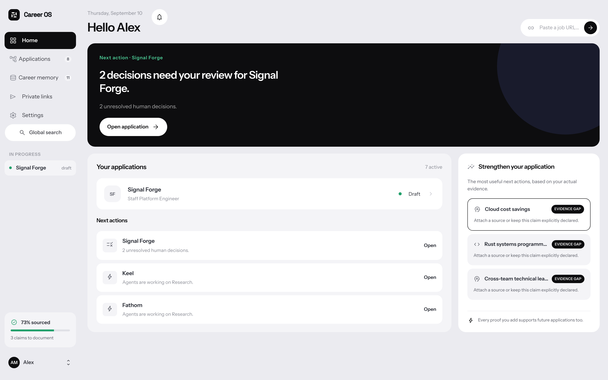
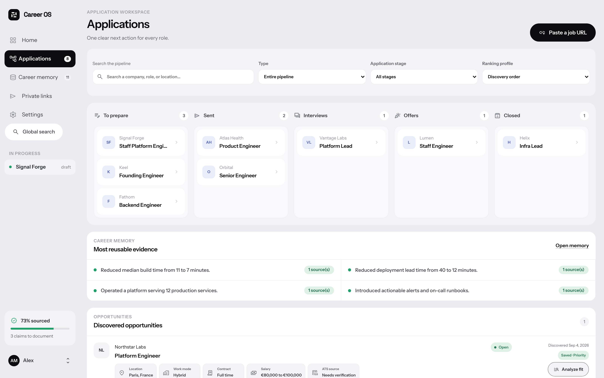
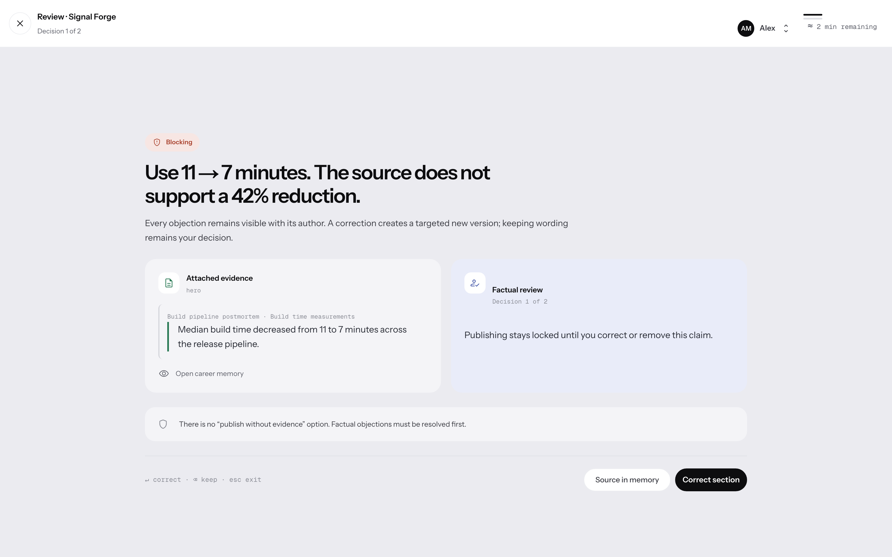
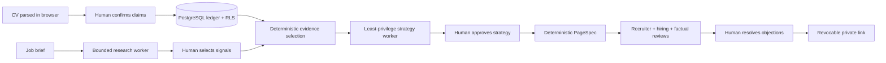

# Career OS

> A resume says you can do the job. Career OS shows its receipts.

[](https://github.com/kevinmarty69/career-os/actions/workflows/ci.yml)
[](LICENSE)

Career OS is an open-source workspace for evidence-backed job applications. Import your career history, find relevant opportunities, prepare a tailored application, and review what the agents propose before sharing it.

Career Memory distinguishes `verified`, `declared`, `inferred`, and `unsupported` claims. Inferences are not publishable as facts, and unsupported claims cannot be included in a published page. Models research and suggest; you remain responsible for your claims, application strategy, and final approval.



Screenshots show the implemented interface in English with **synthetic data**, not customer activity or live agent results. [Capture provenance and reproduction](docs/build-in-public/2026-09-10-product-captures/README.md).

## What you can do

- **Build Career Memory.** Import PDF, DOCX, TXT, pasted text, or a LinkedIn export (ZIP / Positions.csv, positions only). Review extracted claims, their sources, sensitivity, and allowed uses before saving them. Raw document parsing runs in a browser Web Worker; accepted career data is persisted in your workspace.
- **Find and assess opportunities.** Save search profiles with hard constraints and preferences, configure scheduled discovery from supported job boards, import a job URL, and compare the role against your evidence. Missing information stays unknown; model-backed semantic analysis requires a configured provider.
- **Manage applications.** Track preparation, sent applications, interviews, offers, and closed dossiers in one pipeline, with contacts, tasks, a timeline, and interview debriefs. Home surfaces dated follow-ups; Insights compares recorded responses by confirmed submission age, keeping unknown dates separate. Silence never changes an application's status.
- **Prepare and review a private page.** Research the company, select evidence, approve the strategy, then resolve recruiter, hiring-manager, and factual reviews. Corrections produce new versions; publication remains a separate human decision.
- **Share deliberately.** Publish an expiring, revocable private link and inspect recorded engagement. Contact research produces suggestions and drafts; Career OS does not send applications or messages for you.
- **Work in English or French.** Change the interface language from your account menu → Profile settings. This does not translate your imported documents or application content.

<details>
<summary>Application pipeline</summary>



The five-stage pipeline is visible; the secondary Opportunities section continues below the captured viewport. Long labels use the interface's normal ellipses.

</details>

<details>
<summary>Human review and source evidence</summary>



</details>

## Try the read-only demo

Use Node.js 22+ and the pnpm version pinned in `package.json`. The `/demo` route is a **static, synthetic walkthrough**, not an executing agent workflow. It needs no account, database, or model:

```bash
git clone https://github.com/kevinmarty69/career-os.git
cd career-os
pnpm install --frozen-lockfile
pnpm dev
```

Open [localhost:3000/demo](http://localhost:3000/demo). It illustrates career evidence, opportunity matching, human review, and a private-page preview. It does not import files, run models, save data, or publish anything. The populated workspace screenshots above use separate browser-test fixtures; they are not the `/demo` screen.

For signup, CV import, and a persisted workspace, follow the real-workflow setup below.

## The trust boundary is the product



Each durable worker has its own non-owner database login and a narrow function set. Jobs are leased globally without a caller-supplied tenant ID. Model calls happen outside database transactions, under a reserved token budget; an unknown provider outcome fails closed instead of being replayed.

## Runtime and scope

- Supabase Auth sessions and tenant-scoped, versioned Career Memory;
- SSRF-resistant job URL previews that remain untrusted until confirmed;
- durable, resumable workflow steps with idempotency, leases, and admission limits;
- human gates around research, evidence, strategy, review, and publication;
- tenant isolation with forced RLS and composite tenant foreign keys;
- revocable private capabilities exchanged for secure session cookies;
- export, interruption, worker readiness, and conservative failure settlement.

This repository contains the **self-hosted core**, not the managed Cloud distribution. It does not supply a hosted model, provider credits, billing, managed backups, or operated email delivery. Installation does not enable paid model calls.

The [product reference](docs/PRODUCT-REFERENCE.md) describes the target scope, not a promise that every planned feature is finished. OAuth providers need operator configuration; discovery is limited to supported sources; placeholder routes are not delivered features. Configured code and synthetic tests are not proof of a live, fully validated deployment.

## Proof map

| Claim                                                           | Executable evidence                                                                                                                              |
| --------------------------------------------------------------- | ------------------------------------------------------------------------------------------------------------------------------------------------ |
| Generated statements remain source-bound                        | [`schemas.ts`](lib/schemas.ts), [`reviewer.test.ts`](tests/unit/reviewer.test.ts)                                                                |
| Tenant data cannot cross organization boundaries                | [`tenant_isolation.sql`](supabase/tests/tenant_isolation.sql), [`auth_security.sql`](supabase/tests/auth_security.sql)                           |
| Retries do not duplicate accepted work or spend                 | [`durable-step-concurrency.mjs`](supabase/tests/durable-step-concurrency.mjs), [`budget_concurrency.mjs`](supabase/tests/budget_concurrency.mjs) |
| Workflow usage stays inside its token and cost budgets          | [`budget_concurrency.mjs`](supabase/tests/budget_concurrency.mjs), [`agent-runs.test.ts`](tests/integration/agent-runs.test.ts)                  |
| Scheduled discovery does not double-claim due profiles          | [`scheduled-discovery-concurrency.mjs`](supabase/tests/scheduled-discovery-concurrency.mjs)                                                      |
| URL import resists SSRF and unsafe redirects                    | [`safe-http.ts`](lib/server/safe-http.ts), [`safe-http.test.ts`](tests/unit/safe-http.test.ts)                                                   |
| CV bytes stay in the browser and hostile documents fail closed  | [`profile-import.worker.ts`](lib/profile-import.worker.ts), [`profile-import.test.ts`](tests/unit/profile-import.test.ts)                        |
| Publication requires complete, current reviews                  | [`durable-reviewers.mjs`](supabase/tests/durable-reviewers.mjs), [`publication-security.test.ts`](tests/unit/publication-security.test.ts)       |
| Critical failures explain the safe recovery action              | [`application-dossier.spec.ts`](tests/e2e/application-dossier.spec.ts), [`opportunities-ui.spec.ts`](tests/e2e/opportunities-ui.spec.ts)         |
| Security boundaries fail closed as one executable gate          | [`SECURITY.md`](SECURITY.md), [`package.json`](package.json)                                                                                     |
| The active front has keyboard, contrast and semantic-tree tests | [`accessibility.spec.ts`](tests/e2e/accessibility.spec.ts), [`design-system-v2.test.ts`](tests/unit/design-system-v2.test.ts)                    |

The [CI workflow](.github/workflows/ci.yml) is configured to run formatting, zero-warning lint, TypeScript, unit tests, a production build, PostgreSQL isolation and concurrency tests, HTTP integration, all worker integration tests, and a production-dependency audit. Chromium and mobile browser checks cover the application workflow, keyboard accessibility, computed contrast, and responsive layout. Browser workflow tests mock the API; SQL and HTTP tests independently verify persistence and authorization. See the linked CI run for its current result, not the presence of a test file alone.

## Run the real workflow

The persisted workflow needs:

- **Supabase Auth + PostgreSQL 17**, either an existing Supabase project or an operator-managed Supabase instance;
- a restricted application database login and **eight isolated worker credentials**, with workers supervised separately;
- your own **OpenAI-compatible Chat Completions endpoint**, local or explicitly configured remote BYOK, for model-backed research, strategy, and qualitative reviews;
- an isolated deterministic page composer: the native macOS adapter requires Node.js 24+; Linux uses the documented Docker adapter or a separately operated sandbox host.

Evidence checks and page composition do not need a model. Remote processing sends permitted context to your chosen provider and requires explicit cost rates and limits. No model is downloaded or supplied by the open-source edition. See [Model setup](docs/MODEL_SETUP.md) for transport, privacy, budgets, and the optional adaptive interview.

See **[Self-hosting Career OS](docs/SELF_HOSTING.md)** for the complete setup, least-privilege role creation, worker supervision, and verification commands.

Use the documented migration runner, not raw historical SQL or `supabase db push`. Keep operator credentials separate from app credentials. Configure SMTP before inviting external users; email delivery and OAuth are not enabled merely by starting Next.js.

## Development

Account/session flows use Supabase Auth. See [Self-hosting](docs/SELF_HOSTING.md)
for signup/SMTP setup and [ADR-006](docs/ADR-006-supabase-auth.md) for identity boundaries.
Local validation uses the configured Supabase development project and disposable
synthetic accounts. Destructive persisted fixtures run only in isolated CI with
native PostgreSQL and official GoTrue, without Docker.

See [CONTRIBUTING.md](CONTRIBUTING.md) for module boundaries and the checks expected for each change.

```bash
pnpm check
pnpm build
pnpm audit --prod --audit-level high
```

Database verification in isolated CI (not on the workstation):

```bash
pnpm test:native pnpm verify:persisted
pnpm test:native pnpm test:security
```

For local account/CV/persistence validation, use the scoped Supabase smoke command
in [Self-hosting](docs/SELF_HOSTING.md). Browser contract checks:

```bash
pnpm test:accessibility
pnpm test:e2e
```

The PostgreSQL test suite also covers migration compatibility on PostgreSQL 17 without pgvector.

The in-process runtime in [`scripts/simulation/`](scripts/simulation/agent-runtime.ts) is a benchmark tool. Its tests cover simulated contracts, not database leases, crash recovery, or production budget settlement. The application uses [`lib/server/runs.ts`](lib/server/runs.ts) and the durable SQL workers.

## Decisions worth inspecting

- [Architecture](ARCHITECTURE.md)
- [Security model](SECURITY.md)
- [Why Career OS owns orchestration](docs/ADR-001-agent-runtime.md)
- [Agentic stack benchmark](docs/agentic-stack-benchmark.md)
- [Minimum agentic stack proposal](docs/ADR-002-agentic-stack-selection.md)
- [Authentication and tenancy](docs/ADR-003-authentication.md)

AGPL-3.0-only. See [LICENSE](LICENSE).
