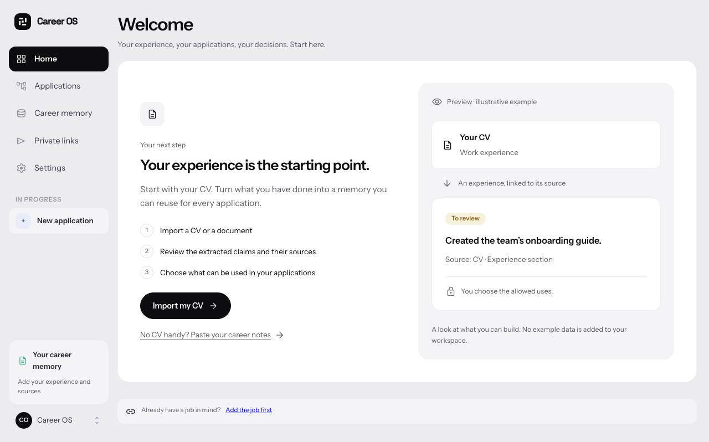
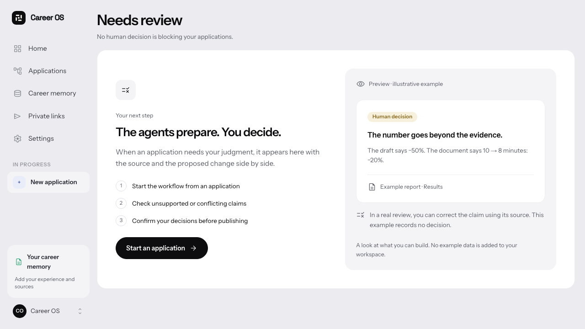

# Empty states that explain the next step

The first session should explain what Career OS does, not present a dashboard full of zeros.

- Home, career memory, applications, decisions, private links and run history now explain the next action and show the expected result.
- The home page starts with CV import, then introduces the job application flow once career memory contains sources or claims.
- Examples are visibly labelled, read-only illustrations. They are never inserted into a profile, application or workflow.
- Existing document import and job URL import are the real entry points. No tutorial engine, new dependency or automatic application submission.
- Empty, loading and failed states are separate. An unavailable workspace is not presented as a new one; an empty memory is not described as fully sourced.
- Existing designer tokens, Material Symbols, typography and monochrome primary actions; English and French copy.

Validation: `pnpm check`, production build, and 8 Playwright checks across desktop/mobile and both languages. Browser tests use mocked API responses to isolate empty/populated/error states; they do not prove a live AI run or database persistence.

