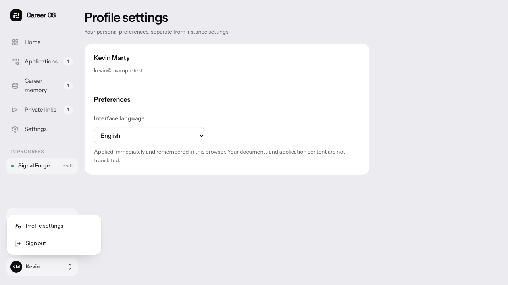

# Personal preferences belong to the account

Click your first name to open Profile settings or sign out. The account menu is available on desktop and mobile, including application dossiers and CV import. Instance configuration stays separate.

- Interface language switches immediately between French and English and persists in this browser using the existing locale cookie. Documents and application content remain unchanged; this is not an account-wide synchronized preference.
- Native disclosure behavior with keyboard access, Escape/focus restoration and outside-click dismissal.
- Sign out uses Better Auth. Failed requests keep the user on the page with a retryable error. Successful sign-out removes the current tab's temporary CV import review and performs a full navigation to sign-in.
- No new dependency or custom authentication endpoint.

Validation: `pnpm check`, production build, 12 desktop/mobile browser checks (account settings and onboarding regression). Auth responses are mocked in these UI tests; they test API wiring and success/failure handling, not a live provider session.

