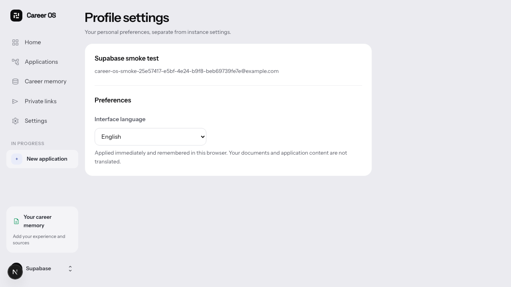

# Supabase Auth integration milestone

Career OS now signs users in through Supabase Auth instead of running a second
credential system. Its private workspace membership and RLS boundaries remain
owned by the application.

Verified locally against a fresh managed Supabase project:

- Password login, workspace creation, persisted application read/write, workspace
  export and UI sign-out.
- Cross-account workspace selection and forged workspace cookies are refused.
- A logged-out session cannot be replayed to access application data.
- Runtime database access uses a restricted login; admin credentials never enter
  browser or app runtime configuration. Worker logins remain separate.
- New migration checks protect Supabase's reserved Auth schema.
- Formatting, zero-warning lint, TypeScript and 217 unit tests pass; production
  build and four desktop/mobile account-menu checks pass. All eight worker
  database roles passed an idle iteration without inference or external scraping.

The screenshot is in English and uses a synthetic test identity, removed after
verification. This is a local integration milestone, not a cloud deployment or
an OAuth launch. Google/LinkedIn credentials are not configured. The old
Better Auth integration harness still needs migration before this branch merges.
