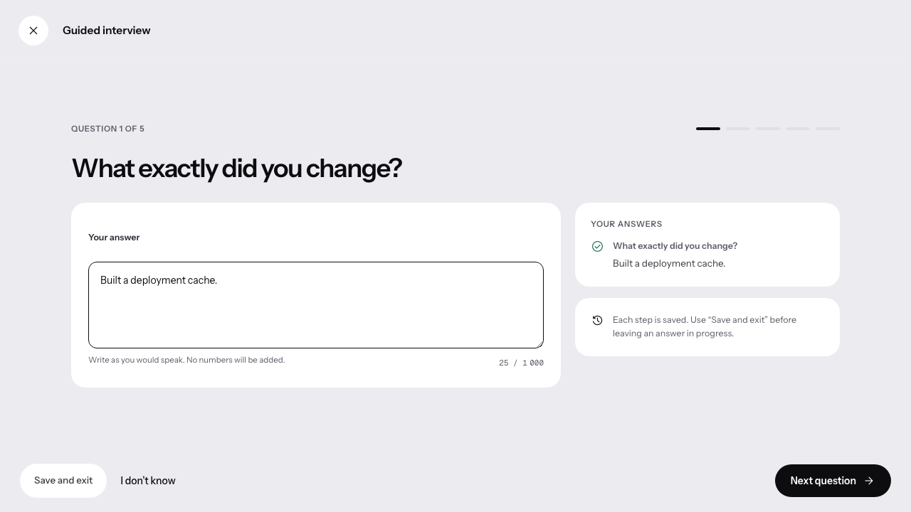
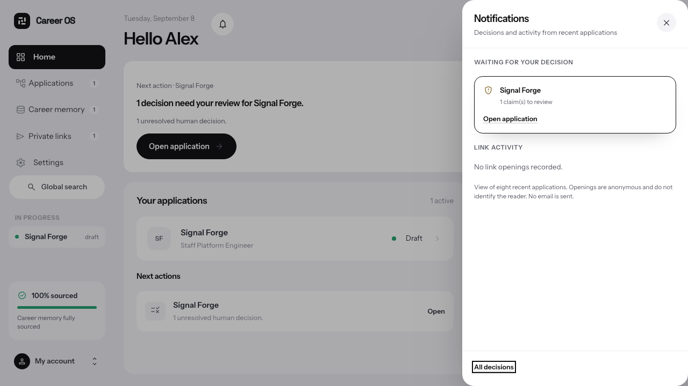
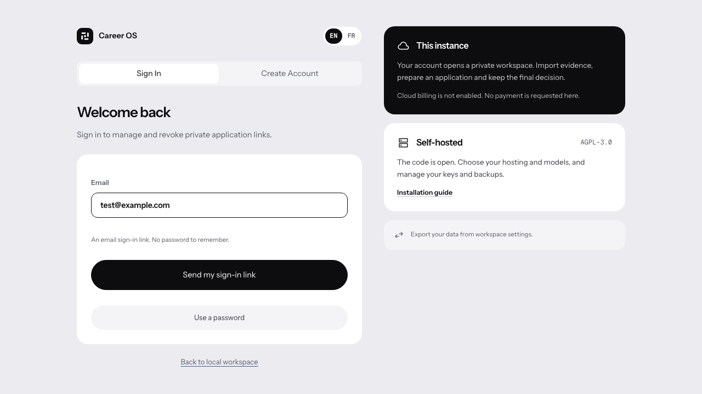

# Handoff 4 — product UI milestone

Captured on 8 September 2026 from the local production build, in English.
These are real rendered interfaces with **synthetic test data**, not live customer activity.

## Concrete changes

- A five-question interview can be saved, resumed and signed. The resulting statement remains private and declared, never automatically verified or published.
- The notification drawer exposes workspace decisions and anonymous link activity, with keyboard focus trapped and restored correctly.
- Account entry uses Supabase email links with a password fallback. The test intercepts the PKCE request; no real email delivery is claimed.

Validation and deliberate limits: [handoff integration log](../../HANDOFF-4.md).
Do not describe inactive cloud billing, connectors or the questionnaire as live agent services.
