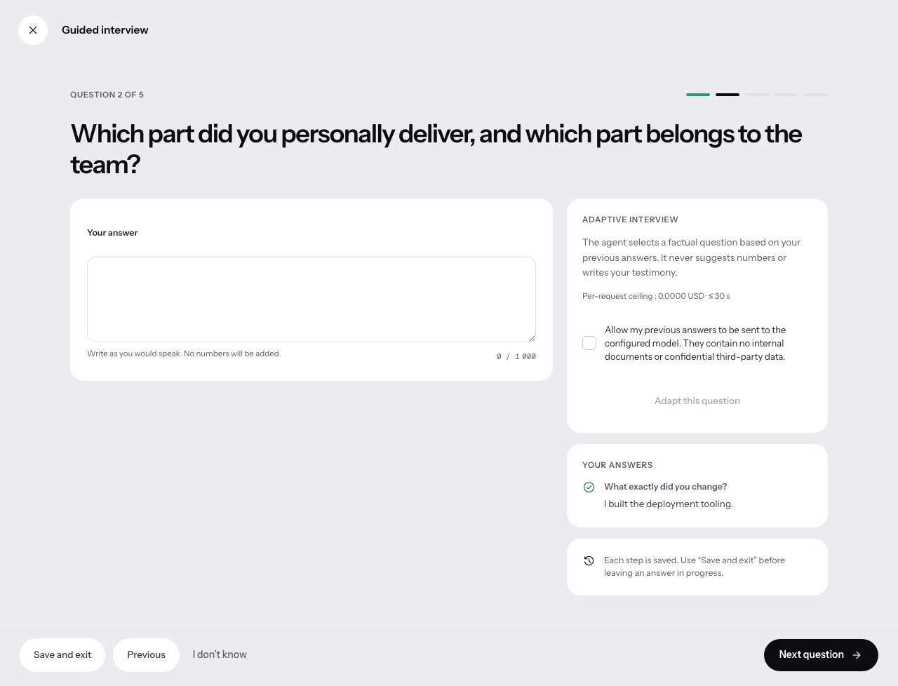

# Handoff 4 — product UI milestone

Captured on 8 September 2026 from the local production build, in English.
These are real rendered interfaces with **synthetic test data**, not live customer activity.

## Concrete changes

- A five-question interview can be saved, resumed and signed. The resulting statement remains private and declared, never automatically verified or published.
- The notification drawer exposes workspace decisions and anonymous link activity, with keyboard focus trapped and restored correctly.
- Account entry uses Supabase email links with a password fallback. The test intercepts the PKCE request; no real email delivery is claimed.

Validation and deliberate limits: [handoff integration log](../../HANDOFF-4.md).
Do not describe inactive cloud billing, connectors or the questionnaire as live agent services.

## 9 September — optional adaptive questions

The rendered interview can now select a factual question from a fixed catalogue after explicit consent. Manual answers and save/resume remain available on provider failure. The screenshot below uses synthetic answers and an intercepted provider response, not a real model call. The displayed zero ceiling belongs to that test configuration, not a provider pricing claim.

Also delivered: a durable browser outbox for review decisions and additional in-app notifications. Neither feature sends email or publishes a page automatically.
